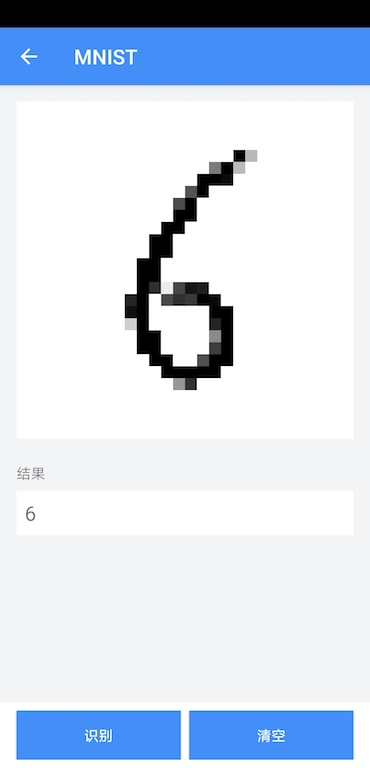
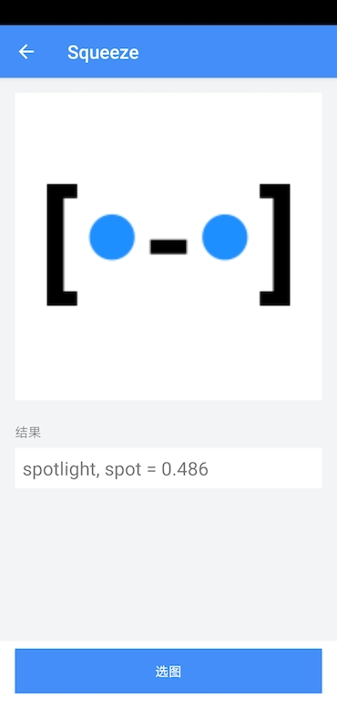

<div align="middle">
    
</div>

[](https://travis-ci.org/didi/AoE)
[ ](https://bintray.com/aoe/maven/library-core/_latestVersion)
[](https://cocoapods.org/pods/AoE)
[](https://github.com/didi/aoe/blob/master/LICENSE)

 [文档](https://didi.github.io/AoE/) |
 [发布记录](./CHANGELOG.md) |
 [路线图](./ROADMAP.md) |
 [English](./README_en.md)

## 一、背景
### 1. AoE 是什么?
**AoE** (AI on Edge，终端智能，边缘计算) 是一个滴滴开源的 **终端侧 AI 集成运行时环境 ( IRE )**。以 **“稳定性、易用性、安全性”** 为设计原则，帮助开发者将不同框架的深度学习算法轻松部署到终端高效执行。

为什么要做一个终端 AI 集成运行时框架：

* **框架多样性**，随着人工智能技术快速发展，这两年涌现出了许多运行在终端的推理框架，一方面给开发者带来更多选择，另外一方面也增加了将 AI 布署到终端的成本。
* **流程繁琐**，通过推理框架直接接入 AI 的流程比较繁琐，涉及到动态库接入、资源加载、前处理、后处理、资源释放、模型升级，以及如何保障稳定性等问题。

### 2. AoE如何支持各种推理框架
无论是什么推理框架，都包含下面 5 个处理过程，对这些推理过程进行抽象，是 AoE 支持各种推理框架的基础。如下以 NCNN 和 TensorFlow Lite 这两种推理框架为例，说明一下 5 个推理过程在各自推理框架里的形式。

<table border="1">
  <tr>
    <th>推理框架</th>
    <th>初始化</th>
    <th>前处理</th>
    <th>执行推理</th>
    <th>后处理</th>
    <th>释放资源</th>
  </tr>
  <tr>
    <td>NCNN</td>
    <td>
        <code>
            int load_param(const unsigned char* mem);
            int load_model(const unsigned char* mem);
        </code>
    </td>
    <td>
        <code>
            ...
        </code>
    </td>
    <td>
        <code>
            int input(const char* blob_name, const Mat& in);
            int extract(const char* blob_name, Mat& feat);
        </code>
    </td>
    <td>
        <code>
            ...
        </code>
    </td>
    <td>
        <code>
            void release();
        </code>
    </td>
  </tr>
  <tr>
    <td>TensorFlow Lite</td>
        <td>
        <code>
            public Interpreter(@NonNull ByteBuffer byteBuffer, Interpreter.Options options);
        </code>
    </td>
    <td>
        <code>
            ...
        </code>
    </td>
    <td>
        <code>
            public void run(Object input, Object output);
        </code>
    </td>
    <td>
        <code>
            ...
        </code>
    </td>
    <td>
        <code>
            public void close();
        </code>
    </td>
  </tr>
</table>


### 3. AoE支持哪些平台
目前，AoE 提供了 Android 和 iOS 的实现，Linux 平台运行时环境 SDK 正在紧锣密鼓地开发中，预计在 9 月底发布，方便智能终端设备上落地 AI 业务。

## 二、工作原理
### 1. 抽象推理框架的处理过程
通过依赖倒置的设计，使得业务只依赖 AoE 的上层抽象，而不用关心具体推理框架的接入实现。开发者随时可以添加新的推理框架，而不用修改以前业务接入的代码，做到了业务开发和 AoE SDK 开发完全解耦。

## 2. 稳定性保障
为 Android 平台上提供了独立进程运行机制，让 Native 操作运行在独立进程中，保证了主进程的稳定性，即偶然性的崩溃不会影响后续的推理操作，且主进程任何时候不会崩溃。

## 三、MNIST集成示例
*1. 对TensorFlowLiteInterpreter的继承*

当我们要接入一个新的模型时，首先要确定的是这个模型运行在哪一个推理框架上，然后继承这个推理框架的 InterpreterComponent 实现，完成具体的业务流程。

MNIST 是运行在 TF Lite 框架上的模型，因此，我们继承 AoE 的 TFLite Interpreter 实现，将输入数据转成模型的输入，再从模型的输出读取业务需要的数据。

```
public class MnistInterpreter extends TensorFlowLiteInterpreter<float[], Integer, float[], float[][]> {
 
    @Nullable
    @Override
    public float[] preProcess(@NonNull float[] input) {
        return input;
    }
 
    @Nullable
    @Override
    public Integer postProcess(@Nullable float[][] modelOutput) {
        if (modelOutput != null && modelOutput.length == 1) {
            for (int i = 0; i < modelOutput[0].length; i++) {
                if (Float.compare(modelOutput[0][i], 1f) == 0) {
                    return i;
                }
            }
        }
        return null;
    }
}
```

*2. 运行时环境配置*

接入MNIST的第二个步骤是配置推理框架类型和模型相关参数，代码如下：
```
mClient = new AoeClient(requireContext(), "mnist",
        new AoeClient.Options()
                .setInterpreter(MnistInterpreter.class)/*
                .useRemoteService(false)*/,
        "mnist");
```

*3. 推理执行*

以下是MINST初始化推理框架、推理执行和资源回收的实现：
```
// 初始化推理框架
int resultCode = mClient.init();
// 推理执行
Object result = mClient.process(mSketchModel.getPixelData());
if (result instanceof Integer) {
    int num = (int) result;
    Log.d(TAG, "num: " + num);
    mResultTextView.setText((num == -1) ? "Not recognized." : String.valueOf(num));
}
// 资源回收
if (mClient != null) {
    mClient.release();
}

```

## 四、使用文档&示例
- [Android用户指南](./Android/README.md)
- [iOS用户指南](./iOS/README.md)
- [Android Demo](./Android/samples/demo)
- [iOS Demo](./iOS/Demo)
- [更多应用案例](./Catalog.md)

| MNIST 手写数字识别 | SqueezeNet 物体识别 |
|---|---|
|   ||

## 五、Q&A

* `欢迎直接提交 issues 和 PRs`  [>>>🔥PR激励活动进行中～](https://github.com/didi/AoE/issues/14)


| QQ群号： 815254379 | 微信群：9月11号前有效  |
|---|---|
|   ||
    


## 六、项目成员
### 核心成员

[kuloud](https://github.com/Kuloud)、
[dingc](https://github.com/qtdc1229) 、
[coleman.zou](https://github.com/zouyuefu) 、
[yangke1120](https://github.com/yangke1120) 、
[tangjiaxu](https://github.com/shupiankuaile) 

## 七、友情链接
我们部门的另外一款开源作品 [Dokit](https://github.com/didi/DoraemonKit)，一款功能齐全的客户端（ iOS 、Android ）研发助手，你值得拥有 :)

